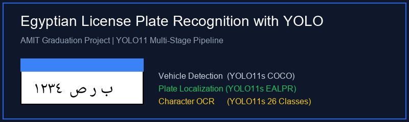
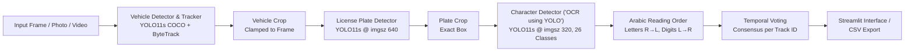

# Egyptian License Plate Recognition with YOLO

[](https://www.python.org/downloads/)
[](https://github.com/ultralytics/ultralytics)
[](https://streamlit.io/)
[](LICENSE)

An end-to-end computer vision and OCR system for automatic **Egyptian License Plate Recognition (ALPR)** using YOLO11. This project detects vehicles, localizes license plates, detects individual characters and numbers, reconstructs the true Arabic reading order (letters right-to-left, digits left-to-right), and tracks vehicles across video frames using ByteTrack and temporal voting consensus.

Developed as a graduation project for the **AMIT Data Science & AI Diploma** (project *"OCR using YOLO"*).

---

<!-- Demo placeholder: add your demo GIF or application screenshot below -->


---

## Pipeline Architecture

The system operates as a hierarchical multi-stage computer vision pipeline:



1. **Vehicle Detection & Tracking**: Pretrained `yolo11s.pt` (COCO) detects vehicles (`car`, `motorcycle`, `bus`, `truck`). Video mode tracks vehicles across frames using `ByteTrack`. If a street photo has no vehicle detected, close-up fallback runs directly on the entire image.
2. **License Plate Detection**: Fine-tuned `plate_best.pt` localizes the plate box on each vehicle crop at `imgsz 640`.
3. **Character Detection ("OCR using YOLO")**: Fine-tuned `char_best.pt` runs class-agnostic NMS at `imgsz 320` over the plate crop, detecting 26 classes (17 Arabic letters + 9 Arabic-Indic digits).
4. **Reading Order Reconstruction**: Pure function `boxes_to_text(names, xcs)` separates digits and letters:
   - **Digits**: Sorted by x-center ascending (left to right).
   - **Letters**: Sorted by x-center descending (right to left).
   - `plate_text`: Compact alphanumeric string (used for voting and CSV logging).
   - `display_text`: Isolated Arabic letters separated by spaces followed by digits (prevents cursive ligatures and mimics real plates).
5. **Temporal Video Voting**: Accumulates candidate readings per ByteTrack ID. Once a reading reaches $\ge 3$ votes and strictly exceeds second place, the track is locked. Further inference on that vehicle is bypassed for maximum throughput.

---

## Dataset & Data Preparation

The model was trained on the **EALPR** dataset ([Ahmed Ramadan et al., ACIRS 2022](https://github.com/ahmedramadan96/EALPR)).

### Data Preparation Summary
- **Initial Dataset**: 2,087 car images, 2,069 plate crops, and 10,797 character boxes.
- **Deduplication**: Exact duplicates removed via MD5 hashing; near duplicates eliminated using perceptual hashing (pHash).
- **Cleaning**: Unreadable, unlabeled, and empty images removed (<5% each). Broken bounding boxes purged, and all boxes strictly clipped to image bounds.
- **Class Balance**: Class `٠` (Arabic digit zero) was omitted due to only 1 broken instance in the entire dataset. Class imbalance of $\approx 9.4:1$ (highest class `١` vs rarest class `ص`) was handled by oversampling rare characters (capped at 3 copies) paired with spatial and color augmentations (**never horizontal flipping**).
- **Vehicle-Level Split (70 / 21 / 9)**:
  - **Train**: 1,358 cars, 1,288 plates
  - **Validation**: 407 cars, 376 plates
  - **Test**: 175 cars, 170 plates

---

## Training Settings

Both models were trained using Ultralytics YOLO11s:

| Hyperparameter / Setting | Plate Detector (`plate_best.pt`) | Character Detector (`char_best.pt`) |
| :--- | :--- | :--- |
| **Base Architecture** | YOLO11s | YOLO11s |
| **Input Resolution (`imgsz`)** | 640 | 320 |
| **Epochs** | 50 | 80 |
| **Batch Size** | 16 | 32 |
| **Early Stopping Patience** | 10 | 15 |
| **Weight Decay** | 0.0005 | Default |
| **Horizontal Flip (`fliplr`)**| Default | **0.0** (strictly disabled for OCR) |
| **Rotation (`degrees`)** | Default | $\pm 5^\circ$ |
| **HSV Saturation/Value** | Default | `hsv_v = 0.5` |

---

## Benchmark Results on Test Set

Evaluation performed on the isolated 170-plate test set:

### Detection Metrics
- **Plate Detector**:
  - Precision: **0.983**
  - Recall: **0.987**
  - mAP@50: **0.994**
  - mAP@50:95: **0.876**
- **Character Detector**:
  - Precision: **0.978**
  - Recall: **0.994**
  - mAP@50: **0.988**
  - mAP@50:95: **0.738**

### End-to-End Plate Recognition (170 Test Plates)
- **YOLO Pipeline**:
  - Character Error Rate (CER): **0.053**
  - Exact Plate Match: **93.5%**
- **EasyOCR Baseline**:
  - Character Error Rate (CER): **[FILL]**
  - Exact Plate Match: **[FILL]**

### Inference Latency (NVIDIA L4)
- **Plate Detection**: $\approx 6.5\text{ ms}$ per image
- **Character Recognition**: $\approx 5.5\text{ ms}$ per plate crop

---

## Project Structure

```
├── app.py                            # Streamlit web application interface
├── pipeline.py                       # Model loader, detection pipeline, reading order, voting
├── draw.py                           # Pillow Arabic drawing (NotoNaskhArabic) & plate zoom
├── predict.py                        # Standalone CLI prediction tool for testing
├── requirements.txt                  # Python dependencies
├── packages.txt                      # System dependencies for Streamlit Cloud (libgl1, etc.)
├── pytest.ini                        # Pytest configuration
├── LICENSE                           # MIT License
├── README.md                         # Documentation
├── .gitignore                        # Git ignore rules
├── .streamlit/
│   └── config.toml                   # Streamlit server config (maxUploadSize = 500 MB)
├── assets/
│   └── fonts/
│       ├── NotoNaskhArabic-Regular.ttf # Bundled SIL OFL Arabic font
│       └── OFL.txt                   # SIL Open Font License
├── notebooks/
│   └── Egyptian_Plate_OCR_YOLO.ipynb # Complete training, validation & benchmark notebook
├── samples/
│   ├── .gitkeep                      # Placeholder for test photos and videos
│   ├── test_sample.png               # Sample test car photo
│   └── test_video.mp4                # Sample test traffic video
├── tests/
│   └── test_reading_order.py         # Pytest suite for Arabic reading order & code points
└── weights/
    ├── README.md                     # Documentation for model weights
    ├── plate_best.pt                 # Fine-tuned YOLO11s plate detector (~19 MB)
    └── char_best.pt                  # Fine-tuned YOLO11s character detector (~19 MB)
```

---

## Installation & Setup

### Prerequisites
- Python 3.10 or newer
- Git

### 1. Clone the Repository
```bash
git clone https://github.com/[YOUR-USERNAME]/[YOUR-REPO-NAME].git
cd [YOUR-REPO-NAME]
```

### 2. Environment Setup

#### On Windows (PowerShell):
```powershell
python -m venv venv
.\venv\Scripts\Activate.ps1
pip install -r requirements.txt
```

#### On Linux / macOS:
```bash
python3 -m venv venv
source venv/bin/activate
pip install -r requirements.txt
```

---

## Usage

### 1. Launch the Streamlit Web Application
```bash
streamlit run app.py
```
- Open `http://localhost:8501` in your browser.
- **Photo Mode**: Upload an image to view original vs annotated boxes, a high-resolution zoomed plate gallery, and recognized Arabic text.
- **Video Mode**: Upload a video file (`.mp4`, `.avi`, `.mov`, `.mkv`) to watch live vehicle tracking and locked plate voting consensus. Download the annotated video (`libx264` browser-playable) and an Excel-compatible UTF-8-SIG CSV log.

### 2. Command-Line Interface (`predict.py`)

#### Run inference on an image:
```bash
python predict.py --source samples/test_sample.png --out outputs/
```

#### Run inference on a video:
```bash
python predict.py --source samples/test_video.mp4 --out outputs/
```

#### Command-line arguments:
- `--source`: Path to input photo or video.
- `--out`: Destination directory for annotated outputs (default: `outputs/`).
- `--weights`: Directory containing weights (default: `weights/`).
- `--conf-vehicle`: Vehicle detection threshold (default: `0.4`).
- `--conf-plate`: Plate detection threshold (default: `0.4`).
- `--conf-char`: Character detection threshold (default: `0.4`).

### 3. Run Automated Tests
```bash
pytest
```

---

## Training Notebook
The full training pipeline, exploratory data analysis, augmentations, and evaluation experiments can be reviewed in:
- [`notebooks/Egyptian_Plate_OCR_YOLO.ipynb`](notebooks/Egyptian_Plate_OCR_YOLO.ipynb)

---

## Limitations

- **Severely Distorted Plates**: Heavy angles exceeding $\pm 45^\circ$ or severe physical damage can impair character bounding boxes.
- **Low Light / Night Conditions**: Extreme glare from headlights or underexposed night footage may reduce character recall.
- **Non-Standard Government / Diplomatic Plates**: Trained specifically on civilian Egyptian private vehicle plates (top blue banner with white body).
- **Missing Digit Zero**: Class `٠` is omitted due to dataset sparsity; plates containing `٠` are unsupported.

---

## Future Work

- **Edge Optimization**: Exporting YOLO models to TensorRT FP16 / INT8 engines for real-time edge processing on NVIDIA Jetson.
- **Synthetic Simulation**: Generating extreme corner cases and weather environments using the CARLA simulator.
- **Traffic Analytics**: Adding vehicle speed estimation, trajectory tracking, and directional tripwire line counting.
- **Multi-Camera Association**: Re-identification of vehicle tracks across multiple roadway cameras.

---

## Team & Acknowledgements

- **Team Members**:
  - [NAME 1]
  - [NAME 2]
- **Diploma**: AMIT Data Science & AI Diploma
- **Special Thanks**: Sincere appreciation to the instructors and mentors at **AMIT Learning** for their guidance and support throughout this graduation diploma project.
